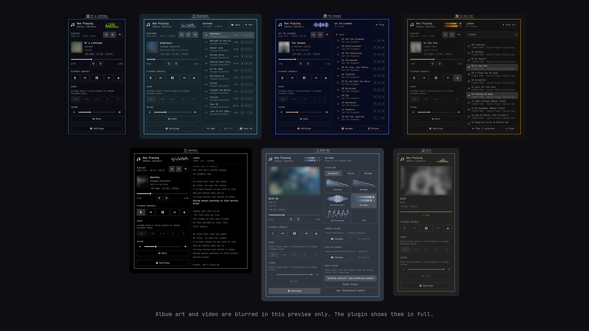

# OMedia Controls

Top bar media plugin for Omarchy.



*Album art and video are blurred in this preview only. The plugin shows them in full.*

A native-styled MPRIS widget for the [Omarchy](https://omarchy.org) shell: album
art and the track title in the bar, and a popup with the full details, transport
controls, a live spectrum visualiser and a picker for whichever players are
running.

It binds MPRIS directly rather than going through the built-in `omarchy.media`
service, whose service half only runs while that plugin's own bar icon is
enabled — this widget replaces that icon, so it cannot depend on it.

## What it does

- **In the bar:** album art and the track title, capped at a width you choose
  so a long title can't push the bar's other sections around; one too long for
  it scrolls. The full title and artist stay in the tooltip.
- **In the popup**, laid out like Omarchy's own panels:
  - a **Now Playing** header with Winamp's classic spectrum analyser beside it;
    click it to cycle through Winamp5's striped analyser, mirrored bars, a VU
    meter, Winamp's oscilloscope and off
  - album art, or for a browser or video player a live view of its window in
    the art's place, across the popup; then title, artist, and album with its
    year and track number, each
    scrolling if too long to fit, and Winamp's bitrate, kHz and stereo as
    small chips beneath; a **seek bar** you can drag or click, a counter that
    flips between length and time remaining, and buttons between the times
    that skip back and forward
  - **playback controls**: lyrics, previous, play/pause (the wide one), next
    and eject.
    Shuffle and repeat sit in the PLAYLIST bar, shown for players that share
    a playlist or have shuffle or repeat (archamp, mpv, Spotify), and never
    for a browser. Its playlist button opens the player's **playlist** in a
    column beside the player — see Playlists below. Eject opens the
    **library**, as in Winamp, in a column beside the
    player: your music folder, folders first, to browse and play, with a
    search box that finds tracks anywhere in it by any words of their artist,
    album or file name. Click to
    select tracks, shift-click for a run, double-click to play one; play a
    whole folder, everything in the one you are in, or your selection, which
    can span folders (the column says how many picks are in other folders).
    The library closes once something is playing.
    The **lyrics** button at the other end of the row opens the playing track's lyrics in the
    same column: a `.lrc` beside a local file, else from LRCLIB. Synced
    lyrics follow the song with the current line lit; click a line to jump
    to it. The button is dimmed when the track has no lyrics. A track or folder plays in the active
    player when it takes files (mpv does), and otherwise in the app your
    desktop opens audio files with
  - **speed**: 1×, 1.25×, 1.5×, 2× and 3×, on players that allow it
  - **volume**, with a labelled mute button. Chromium browsers (Brave,
    Chrome) and any player caught ignoring volume changes get a note instead
    of a slider that does nothing
- **Stable shape:** with nothing playing, or on a player that can't do
  something, controls disable rather than disappear.
- **Several players at once:** anything with a track shows up in a list; click
  one to make it the active player. A playing source wins over a paused one.
  Players that can be closed, such as mpv, have a close button on their row.
- **Mouse:** left-click opens the popup, right-click play/pause, middle-click
  next, scroll to change track. Clicking the popup's album art raises the
  player's own window, when the player supports it.
- **Playlists**, saved as M3U files — see below.
- **Updates:** when a newer release is out, an *Update available* button
  above Now Playing opens its release notes and the exact command Update
  runs (Omarchy's own `omarchy plugin update`), with Update, Dismiss, and a
  copy button for running it in a terminal instead. Updating reloads the
  plugin; the notice then reads *Updated to …*, with Restart shell and Done.
- **Keyboard**, while the popup is open — see below.
- **Commands** for binding hotkeys without opening the popup — see below.

## Playlists

The playlist button in the PLAYLIST bar opens the player's playlist beside
it, for players that share one over MPRIS (archamp does; mpv, Spotify and
browsers don't): numbered, with each song's length, the playing one lit, a
click to play another, and the list's name when it has one.

- **Open** lists your saved playlists: click one to see its tracks, play it,
  move tracks up and down, remove them, rename it, or delete it (to the
  trash). Every change is saved to the file straight away.
- **New** starts an empty saved playlist.
- **Add** browses or searches your music folder and adds the tracks you pick
  to what the player is playing, for players that allow it.
- **Save** keeps what the player is playing as a playlist. Played from a
  saved playlist, the list keeps its name even after you change it, marked
  *edited*: Save then writes the changes back, and **Save as** makes a new one.
- On players that allow it, each song in the playing list can be moved up or
  down and removed.

Playlists are ordinary M3U files, kept in `Playlists` inside your music folder
unless you choose another in Settings, so any player can open them.

## Keyboard

| Key | Does |
| --- | --- |
| Space or `k` | Play / pause |
| ← / → | Seek back / forward (5 seconds unless changed in Settings) |
| ↑ / ↓ | Volume up / down (5% unless changed in Settings) |
| `n` / `p` | Next / previous |
| `m` | Mute |
| `s` | Shuffle |
| `r` | Repeat: off, all, one |
| `[` / `]` | Slower / faster |
| `l` | Go live |
| Esc | Close |

## Commands

Everything the popup does is also a command, for binding keys in
`~/.config/hypr/bindings.lua`:

```bash
omarchy-shell lancefaul.omedia-controls playPause
omarchy-shell lancefaul.omedia-controls next          # and previous
omarchy-shell lancefaul.omedia-controls seek +10      # -10, or 90 for an exact second
omarchy-shell lancefaul.omedia-controls volume -5     # percent; 40 sets it
omarchy-shell lancefaul.omedia-controls speed faster  # slower, or a rate from 0.25 to 4
omarchy-shell lancefaul.omedia-controls mute          # shuffle, repeat, goLive
omarchy-shell lancefaul.omedia-controls toggle        # open, close
omarchy-shell lancefaul.omedia-controls status        # what is playing, as JSON
```

Each replies `ok`, or `unavailable` when the player can't do it. They act on
the player the popup on the focused monitor is showing.

## The visualiser is Winamp's

`spectrum.py` ports Winamp's classic spectrum analyser as
[Webamp](https://github.com/captbaritone/webamp) reconstructs it from the Winamp
2.63 and 5.666 executables, with the Nullsoft FFT from WACUP's `vis_classic`.
Settings are a fresh Winamp install's: nineteen thick bars, bars that rise
instantly and fall linearly, and peaks that hang before falling with
acceleration, all on sixteen stepped levels.

Like Winamp's, they don't follow the volume: the audio is captured after the
player's own volume control, so the widget scales it back up by that volume
(mpv's is cubic, most players' linear) before it is analysed. All of them are
drawn over Winamp's faint dot matrix, in the colours chosen in Settings: a
gradient of your theme's accent from dark to light (the default), the accent
alone, or Winamp's own red-to-green spectrum. Click the visualiser for the
next one; the popup remembers which you chose:

1. **Analyser**, as above.
2. **Winamp5**, the analyser as the Winamp5 Classified skin draws it: the
   same bars, striped a row lit and a row empty, every stripe the same
   height. With Winamp's colours it is plain white, as that skin's is.
3. **Mirrored bars**, like a voice recorder's: the same nineteen bands, as
   thick and square as the analyser's bars, growing up and down from the
   centre line.
   The lowest band sits in the middle and higher ones fan out to both sides,
   so the shape stands tallest in the middle.
4. **VU meter**, stereo: left channel above, right below, each nineteen square
   segments lit by loudness on a -30 dB to 0 dB scale. It rises instantly,
   falls a decibel a frame, and holds each channel's peak for half a second
   before letting it drop.
5. **Oscilloscope**, Winamp's other visualisation, in its default "lines"
   style: the raw waveform across 75 columns on the same sixteen rows,
   brightest near the middle, as Webamp draws it.
6. **Off**, an empty corner, and no audio captured. Click it for the analyser.

## Cost while idle

The visualiser's audio capture and the position probe only run while the popup
is open **and** something is playing. Nothing polls in the background, and the
`parec` monitor stream is not held open the rest of the time. While running,
the analyser takes about 1% of a CPU core at 60 frames a second. The popup's
long lines scroll only while it is open; the bar's title scrolls when it is
too long for its width and a track is loaded, which Settings can turn off.

## Privacy and security

Plugins run unsandboxed inside the Omarchy shell, so here is exactly what this
one does:

- **Reads the playing app's audio while the popup is open on a playing
  track**, from that app's own PipeWire stream (the default output's monitor
  only when its stream can't be found), to draw the visualiser. It is analysed
  in memory; nothing is stored, and the only thing that leaves `spectrum.py`
  is the levels for one frame of the visualisation.
- **Shows the player's window while the popup is open**, for browsers and
  video players only: a live capture of that one window, found through
  Hyprland's window list, shown in the popup and never saved. To notice when
  the app stops drawing it, a 64 by 36 pixel snapshot is taken every two
  seconds and written to `$XDG_RUNTIME_DIR` (memory, cleared at logout) as
  `omedia-feed-0.png` and `omedia-feed-1.png`, overwriting each other.
- **Asks GitHub whether there is a newer release**, once a day while the
  popup is open, or when you press Check now in Settings: one request to
  `api.github.com` for this plugin's latest release, sending nothing but the
  request itself. Turn it off in Settings. A newer release shows its notes
  and the exact update command before anything runs; nothing updates unless
  you press Update.
- **Makes one other kind of network request of its own: lyrics.** Only while the
  popup is open on a track (so the lyrics button can be dimmed when there are
  none), only when the track has no `.lrc` file beside it, and only while
  online lyrics are on in Settings, the plugin asks [LRCLIB](https://lrclib.net) for the track's lyrics,
  sending its artist, title, album and length and nothing else. Each answer,
  found or not, is cached so a song is only asked about once (a miss is
  retried after a week). Cover art is loaded from wherever the player says it
  is, but only as a local `file://`, an `https://` URL, or a base64 raster
  image embedded in the metadata (how mpv sends a file's own cover) — any
  other scheme, plain `http`, SVG, credentials in the URL or control
  characters, and the placeholder is shown instead. The player chooses that
  URL, so an `https` art URL does mean a request to the host the player
  picked.
- **Runs these programs**, always as argument lists and never through a shell
  (and `gio mime audio/mpeg` once at load, for the music player setting, and
  `zenity` when you choose a music or playlist folder):
  - `python3 spectrum.py`, with `parec` and `pactl` inside it, for the
    visualisations
  - `busctl --user` to read a player's position, volume and playlist straight
    from the player; to hand it a track, folder or playlist to play (MPRIS
    `OpenUri`) or a song to jump to; to add and remove songs in its playlist
    (MPRIS `AddTrack`, `RemoveTrack`) and move them (archamp's own
    `MoveTrack`), where the player allows it; and to ask D-Bus which process
    owns a player so its window can be found
  - `ffprobe` to read a local file's bitrate, sample rate and channels
  - `xdg-user-dir MUSIC` and `xdg-mime query default audio/mpeg` once at load,
    to find the music folder and the app that plays audio files
  - `gtk-launch` (or `xdg-open`) to start that app on a picked track when the
    active player cannot take it
  - `install -d -m 700` once at load, to create its state folder
  - `find` on the music folder when you start a search, to list its files
  - `omarchy plugin update lancefaul.omedia-controls --yes` when you press
    Update, `omarchy restart shell` when you press Restart shell, and
    `wl-copy` when you copy the update command
  - `mkdir -p`, `mv -n` and `gio trash` for saved playlists: to create the
    playlist folder the first time one is saved, to rename one, and to move a
    deleted one to the trash

  A player's bus name is refused unless it is shaped like an MPRIS name.
  `ffprobe` only gets an absolute path decoded from a `file://` track URL, and
  the library only plays or adds paths inside the music folder, with no `..`
  segments and no control characters. Playlist names can't contain slashes or
  start with a dot, and renames and deletes only touch files in the playlist
  folder.
- **Treats track metadata as untrusted.** Titles, artists and albums come from
  whichever application registered a player, and are always rendered as plain
  text, including in the bar tooltip.
- **Writes saved playlists** as M3U files in the playlist folder (`Playlists`
  inside your music folder unless you choose another), and only when you
  save, edit, rename or delete one.
- **Writes five files of its own**, in `~/.local/state/omedia-controls/`, a
  folder only you can open. `update.json` keeps the last update check: when it
  ran, the latest release's version and notes, and any update being installed
  (an update reloads the plugin, so it is written down first and read back
  afterwards to say how it went). `preferences.json` holds the choices you make in
  the popup: everything in Settings, the visualisation, and the library folder
  you last browsed. `lyrics-cache.json` holds up to sixty LRCLIB answers, and
  `selection.m3u` the last selection played from the library.
  `live-streams.json` lists the live streams it has detected — the
  app's name and the station's title, such as
  `Brave Origin | Apple Music Country`, and when each was last seen — so a
  station you have heard before shows as LIVE the moment it starts instead of
  after a delay. Nothing else is recorded: no songs, no listening history,
  nothing about normal tracks. It keeps at most 200 stations, drops any whose
  length stops growing, and is read back defensively. Delete the file to clear
  it.
- **Accepts commands** from anything that can reach the shell's IPC
  socket, which is any program running as you. Arguments are parsed strictly
  (`+10`, `-5`, `1.5`) and anything else is refused.
- **Takes the keyboard while the popup is open**, as Omarchy's own panels do,
  and gives it back when it closes.
- **Needs no root** and installs nothing.

## Live streams

Live streams show a full bar in the accent colour with a pulsing dot and
`LIVE` centred beneath it, instead of a position and a duration. There is no
elapsed counter, because a live stream's reported position means nothing:
Apple Music radio's is an offset into its buffer, and YouTube TV's restarts at
zero every thirty seconds while the video plays on. Two kinds are recognised:

- **"Never ends" lengths**, such as YouTube TV in Chromium browsers, which
  report the largest possible length. Recognised immediately.
- **Growing lengths**, such as Apple Music radio, which reports a finite length
  that grows as audio loads. A station starts playing about 48 seconds behind
  the end of what it has loaded, where a song starts at zero, so a station
  reads as `LIVE` the moment it starts, even the first time. Its length then
  has to grow to confirm it, and it is remembered from then on.

Hover `LIVE` on a stream that can rewind, such as YouTube TV, and it becomes
**GO LIVE**, which returns you to the live edge. Apple Music radio has no Go
Live: it already plays at live and cannot rewind, and jumping to the end of
what it has loaded only makes it stall while more arrives.

## Tests

```bash
python3 -m unittest discover -s tests -v
QT_QPA_PLATFORM=offscreen /usr/lib/qt6/bin/qmltestrunner -input tests/tst_logic.qml
```

The first pins the visualisations' behaviour — Winamp's analyser and
oscilloscope, and the VU meter's ballistics; the second covers the pure
logic in `Logic.js`, mostly the checks on input from other applications.

## Requirements

- Omarchy Quattro with its Quickshell-based shell
- `python`, `python-numpy`, and `parec` (from `libpulse`, already present on
  Omarchy) for the spectrum visualiser
- Optionally `ffprobe` (from `ffmpeg`) for a local file's bitrate chip;
  without it, the chips show only the sample rate and channels PipeWire knows
- Optionally `zenity` for choosing a music or playlist folder in Settings;
  without it, the Change… buttons do nothing and the defaults stay
- Any media player that exposes the standard MPRIS interface

## Install

```bash
omarchy plugin add https://github.com/lancefaul/omarchy-omedia-controls.git --enable
```

For local development, link the checkout into the plugins directory instead, so
edits apply without reinstalling:

```bash
# from the root of your checkout
ln -s "$PWD" ~/.config/omarchy/plugins/lancefaul.omedia-controls
omarchy-shell shell rescanPlugins
omarchy plugin enable lancefaul.omedia-controls right
```

Saving a file under `~/.config/omarchy/plugins/` normally reloads the plugin
automatically — but **the watcher does not follow a symlink out to another
directory**, so edits made through the link above need a reload:

```bash
omarchy restart shell
```

Copy the folder in rather than linking it if you would rather have hot reload
than edit in place.

## Why the position is read over D-Bus directly

Quickshell's `position` is extrapolated from whenever it last heard from the
player, and nothing forces a re-read: emitting `positionChanged()` does not,
and a player restarting a track on repeat sends no `Seeked` signal. Measured on
a ten-second file looped by mpv, Quickshell's position kept climbing —
`28.98` against a length of `10.00` — so a bar clamped to the track length just
sat at full and never reset.

So while the popup is open on a playing track, `Position` is read straight off
the player's own D-Bus property with `busctl` every two seconds and
interpolated between reads. Closed popup, nothing running.

## Units, since MPRIS hides them

D-Bus carries `Position` and `mpris:length` in **microseconds**, but Quickshell
converts both to **seconds** before QML sees them (`position=100.058`,
`length=867.76`). `volume` is 0–1. Worth knowing before dividing by a million
that is not there.

## Settings

There are none to edit in a config file: every choice is made in the popup
and remembered. Coming from 1.0, which kept four settings in the shell's
config, any you had changed carry over the first time 2.0 runs: hide when
idle, pause others, the title width (to the nearest width offered, with the
widest going to full length) and a
switched-off analyser (as the Off visualisation). The **Settings** button under the volume opens them beside the
player:

- **Visualiser**: analyser, Winamp5's striped analyser, mirrored bars, VU
  meter, oscilloscope or off, each shown as a snapshot of itself, and their colours
  above them: a gradient of your theme's accent (the default), the accent
  alone, or Winamp's own. Clicking the visualiser itself cycles through them
  too.
- **Updates**: the installed and latest versions, Check now, View update, and
  whether to check daily (on).
- **Library**: the music folder (the desktop's, or one you choose), and the
  app that plays picks the active player can't take (the desktop's, or one of
  the apps it recommends for audio).
- **Playlist folder**: where saved playlists are kept (Playlists inside the
  music folder, or one you choose).
- **Privacy**: look up lyrics online (on), load cover art from the web (on),
  remember live stations (on), and buttons to forget remembered stations and
  clear cached lyrics. With the first two off, the plugin makes no network
  requests at all.
- **Behaviour**: hide the widget when nothing is playing (off; it returns as
  soon as a player has a track), pause other players when one starts (off;
  also switchable from the PLAYERS header), and how wide the title in the bar
  may grow (160 or 260 px, or its full length; 260 by default), and whether a
  title longer than that scrolls (on).
- **Keyboard**: how far ← → and the skip buttons seek (5, 10, 15 or 30 s) and ↑ ↓ change volume (2, 5
  or 10 %).

## Remove

```bash
omarchy plugin remove lancefaul.omedia-controls
```

## Licence

MIT — see [LICENSE](LICENSE).
